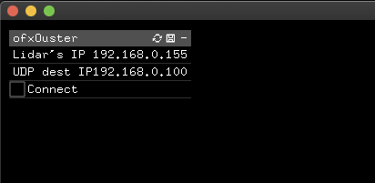

# ofxOusterLidar
openFrameworks addon to use the ouster lidars. 

## Install

You need to install two additional libraries for this addon to work. 
The easiest way is to use [HomeBrew](https://brew.sh/).
Once installed run the following commands in your termial:

```
brew install libtins
brew install jsoncpp
```

open the addon_confing.mk file, scroll down to the bottom
and comment/uncomment the following lines acording to your computer's architechture

```
# uncomment the following for mac intel processors
	ADDON_LIBS = libs/libtins/lib/intel/libtins.4.4.dylib
	ADDON_LIBS += libs/jsoncpp/lib/intel/libjsoncpp.25.dylib


# uncomment the following for mac M1 processors
# 	ADDON_LIBS = libs/libtins/lib/arm/libtins.4.4.dylib
# 	ADDON_LIBS += libs/jsoncpp/lib/arm/libjsoncpp.25.dylib

```

## Dependencies
You will need the following addons

* [ofxDropdown](https://github.com/roymacdonald/ofxDropdown/)

Make sure you have it updated

## Running example

Before running the example make sure you update it with Project Generator.
Just drag the example folder into the Project Generator window and hit Update.

The example will run and you will see the following gui.


Set the correct IP addresses. Double click on it to edit and press enter when ready.

#### Lidar's IP
Set the Lidar's IP to the IP address to either the the static IP address it might have or the dynamic one assigned by the DHCP server (router) of your network. 

If you are not sure, you can connect to the lidar device http://os-XXXXXXXXXXXX.local or http://os1-XXXXXXXXXXXX.local where XXXXXXXXXXXX is the devices serial number which is printed on the top case of the device.

#### UDP dest IP: 
Most probably this is the IP of your computer. You can set this to a different IP if you want to stream to a different computer. 

If you are using a wired connection make sure you deactivate WiFi.

In order to connect the lidar directly to your computer you need to manually set the IP of both your computer and lidar. 

Once this is set just press connect and wait a few seconds and the point cloud will show up.

## TIP:
Change the IP addresses in the ofApp.h file so you dont need to set these each time you run the app.


